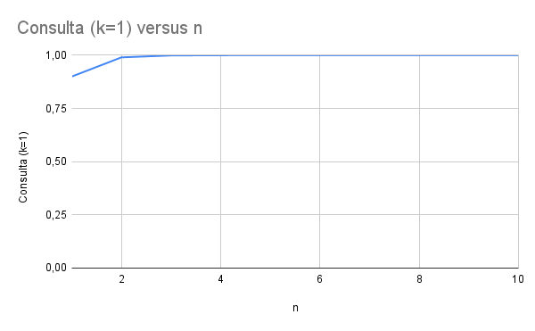
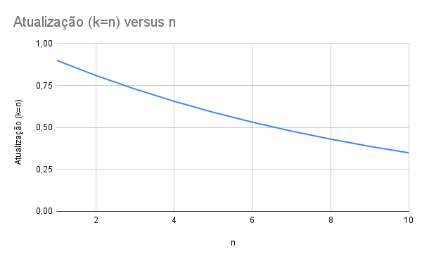

# Disponibilidade em Sistemas Distribuídos

## Integrantes

* Cainã Rios Osterno Rocha - 2315038
* Davi Fernandes Silveira - 2310347
* Marcos André Oliveira Amorim - 2310371
* Pedro Vieira da Silva Xavier - 2315708

---

# Exercício 1.1

## Conceito de Disponibilidade

Disponibilidade é a proporção do tempo em que um sistema está em funcionamento.

Disponibilidade = tempo em operação / (tempo em operação + tempo fora de operação)

Sistemas distribuídos permitem construir sistemas confiáveis a partir de componentes não confiáveis por meio da utilização de redundância. Quando vários servidores replicam um mesmo serviço, o sistema pode continuar funcionando mesmo que alguns servidores falhem.

---

# Parâmetros do problema

n = número total de servidores (n > 0)

k = número mínimo de servidores disponíveis necessários para que o serviço seja acessado de forma consistente (0 < k ≤ n)

p = probabilidade de cada servidor estar disponível em um dado instante (0 ≤ p ≤ 1)

Assume-se que os servidores falham de forma independente.

---

# Derivação da fórmula

Cada servidor possui:

* probabilidade **p** de estar disponível
* probabilidade **1 − p** de estar indisponível

A probabilidade de exatamente **i** servidores estarem disponíveis é dada pela distribuição binomial:

P(i) = C(n,i) p^i (1-p)^(n-i)

Onde C(n,i) representa o número de combinações possíveis.

O serviço estará disponível quando **pelo menos k servidores estiverem funcionando**.

Assim, a disponibilidade do serviço é:

A(n,k,p) = Σ(i=k até n) C(n,i) p^i (1-p)^(n-i)

---

# Casos extremos

## Consulta (k = 1)

Para operações de consulta, basta que pelo menos um servidor esteja disponível.

A probabilidade de todos os servidores estarem indisponíveis é:

(1 − p)^n

Logo, a disponibilidade do serviço é:

A(n,1,p) = 1 − (1 − p)^n

---

## Atualização (k = n)

Para operações de atualização, todos os servidores precisam estar disponíveis simultaneamente.

Logo:

A(n,n,p) = p^n

---

# Dados utilizados nos gráficos

Para gerar os gráficos utilizamos:

p = 0.9

n variando de 1 até 10 servidores.

---

# Gráfico – Consulta

---

# Gráfico – Atualização

---

# Conclusão

A replicação aumenta significativamente a disponibilidade para operações de consulta, pois apenas um servidor precisa estar disponível. Entretanto, para operações de atualização, a disponibilidade diminui à medida que o número de servidores aumenta, pois todas as réplicas precisam estar disponíveis simultaneamente.
